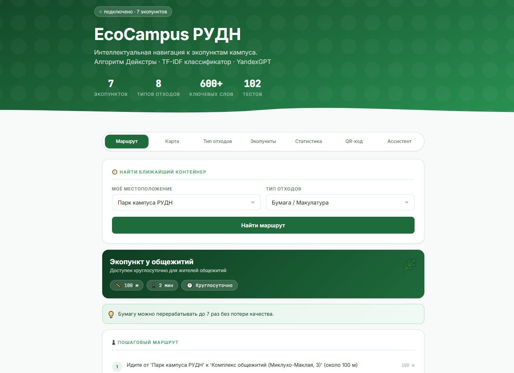
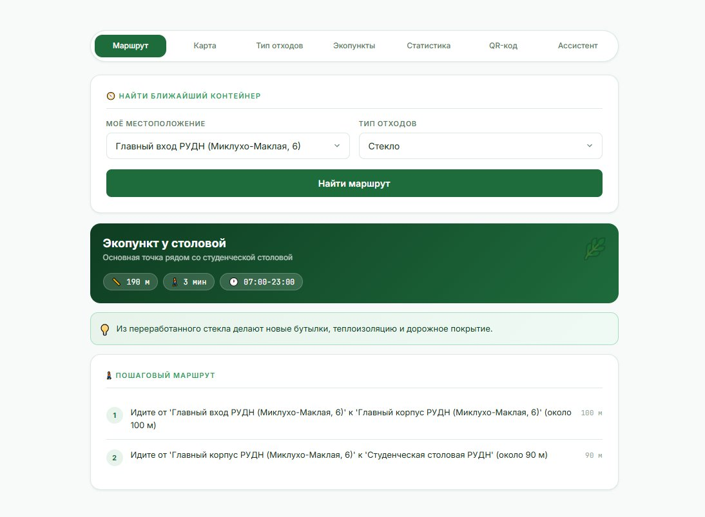
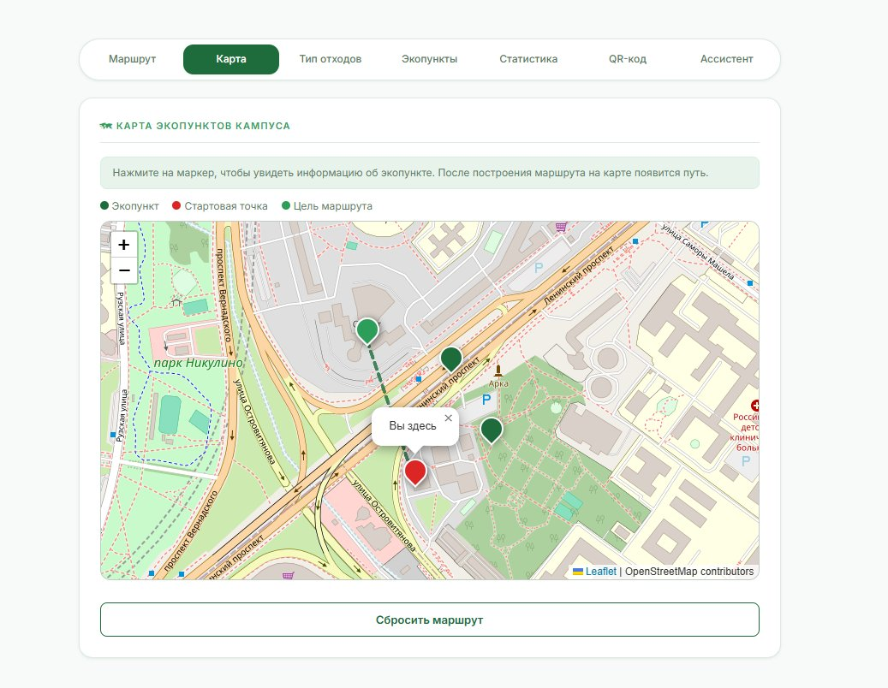
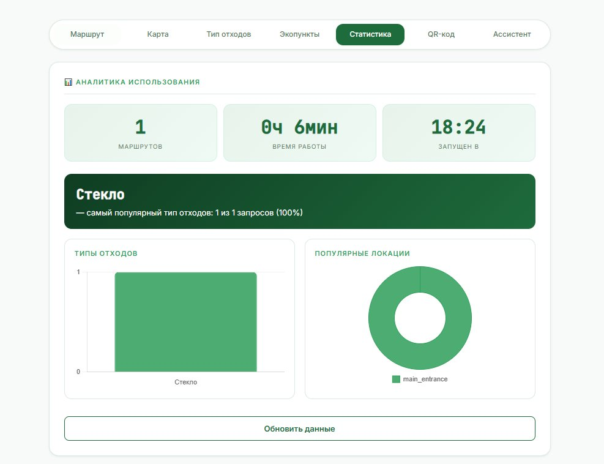
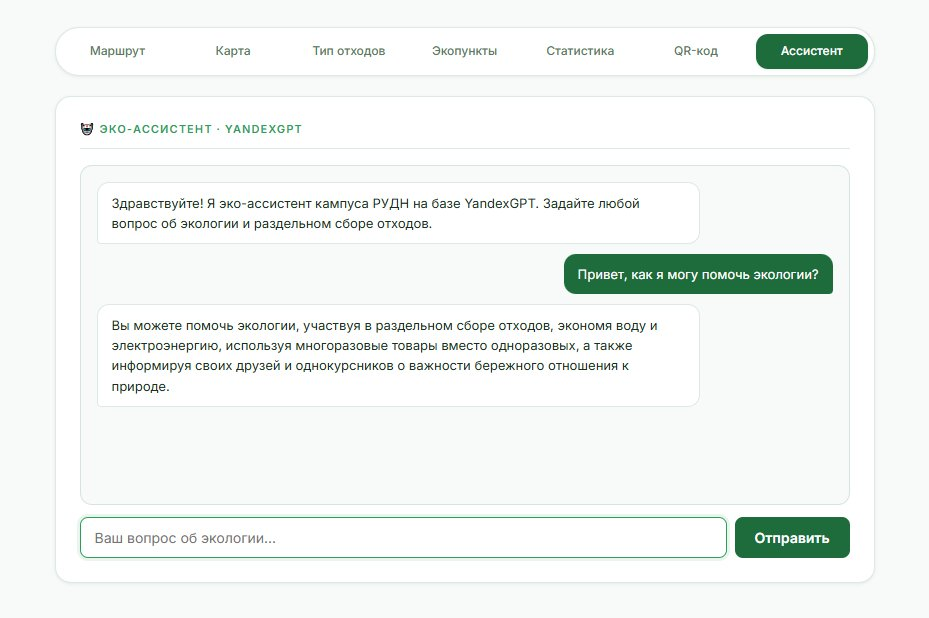

# EcoCampus РУДН


Интеллектуальная система эко-логистики кампуса РУДН. Помогает студентам
и сотрудникам находить ближайший экопункт раздельного сбора отходов
и строит пешеходный маршрут с помощью алгоритма Дейкстры.

🌐 **[Открыть приложение](https://eco-campus-rudn-scalevillain.amvera.io)** &nbsp;·&nbsp; 📖 **[API документация](https://eco-campus-rudn-scalevillain.amvera.io/docs)**

## Скриншоты

| Главная страница | Построение маршрута |
|:---:|:---:|
|  |  |

| Карта экопунктов | Аналитика и графики |
|:---:|:---:|
|  |  |

| Эко-ассистент YandexGPT |
|:---:|
|  |

## Проблема

Раздельный сбор отходов в университетских кампусах не работает не потому,
что людям всё равно, а потому что нет удобной навигации. Студент не знает,
где стоит контейнер для батареек или стекла, как до него дойти и когда он
работает. EcoCampus решает эту проблему.

## Возможности

- Построение маршрута от текущей точки до ближайшего экопункта
- Поддержка 8 типов отходов: пластик, бумага, стекло, металл, текстиль, электроника, органика, смешанные
- Классификация отходов по текстовому описанию на основе TF-IDF взвешивания
- Интерактивная карта кампуса на базе Leaflet и OpenStreetMap
- Telegram-бот с inline-навигацией и автоматической классификацией
- Статистика использования и аналитика популярных локаций
- Генерация QR-кода для размещения у входа в корпуса
- Эко-советы и факты о переработке отходов
- Эко-ассистент на базе YandexGPT — отвечает на вопросы об экологии в свободной форме

## Архитектура

Проект построен по принципу слоистой архитектуры со слабой связанностью модулей.

```
eco_campus/
├── core/                   # Доменная логика (не зависит от фреймворков)
│   ├── models.py           # Доменные модели: WasteType, Container, Route
│   ├── router.py           # Алгоритм Дейкстры через NetworkX
│   ├── classifier.py       # TF-IDF классификатор отходов по тексту
│   ├── stats.py            # Сервис статистики запросов
│   ├── eco_tips.py         # База эко-советов по типам отходов
│   ├── exceptions.py       # Иерархия исключений бизнес-логики
│   └── logger.py           # Профессиональное логирование
├── data/
│   └── campus_data.py      # Граф кампуса и данные контейнеров
├── api/
│   ├── app.py              # FastAPI REST-сервер
│   └── static/
│       └── index.html      # Веб-интерфейс (Leaflet, 6 вкладок)
├── bot/
│   └── telegram_bot.py     # Telegram-бот
└── tests/
    ├── conftest.py          # Общие фикстуры
    ├── test_models.py       # Unit-тесты моделей
    ├── test_router.py       # Unit-тесты маршрутизатора
    ├── test_classifier.py   # Unit-тесты классификатора
    └── test_api.py          # Интеграционные тесты API
```

Слой `core` не знает о существовании FastAPI, Telegram или любого другого
фреймворка. Это означает, что транспортный слой можно заменить без изменения
бизнес-логики.

## Методы искусственного интеллекта

### Алгоритм Дейкстры (маршрутизация)

Кампус представлен в виде взвешенного графа: узлы — ключевые точки
территории, рёбра — пешеходные пути с весами в метрах. Алгоритм Дейкстры
находит кратчайший путь от текущей позиции до каждого подходящего контейнера
и выбирает оптимальный. Тот же принцип используется в картографических
сервисах.

### TF-IDF классификатор (определение типа отходов)

Пользователь описывает предмет в свободной форме: «старый телефон»,
«пластиковая бутылка», «кожура от апельсина». Классификатор:

1. Нормализует текст и разбивает на токены
2. Вычисляет взвешенную сумму совпадений с эталонным словарём каждого типа отходов
3. Нормализует счёт по размеру словаря (TF-IDF-подобный подход)
4. Возвращает тип с наибольшей уверенностью и список найденных ключевых слов

Поддерживает русский и английский язык. При низкой уверенности возвращает
тип MIXED как безопасный fallback.

## Стек технологий

| Компонент | Технология |
|---|---|
| API | FastAPI 0.111+ |
| Маршрутизация | NetworkX 3.3+ |
| Веб-интерфейс | HTML/JS + Leaflet.js |
| Telegram-бот | python-telegram-bot 21+ |
| Тесты | pytest + pytest-cov |
| Язык | Python 3.11+ |
| Чат-бот | YandexGPT Lite API |

## Установка и запуск

### Требования

- Python 3.11+
- pip

### Установка

```bash
git clone https://github.com/kalekakenqq/eco_campus_rudn_v2.git
cd eco_campus_rudn_v2
pip install -e ".[dev]"
```

### Запуск API и веб-интерфейса

```bash
# Из корневой папки репозитория (не из eco_campus)
python -m uvicorn eco_campus.api.app:app --reload
```

Браузер откроется автоматически на `http://127.0.0.1:8000`.
Документация API доступна на `http://127.0.0.1:8000/docs`.

### Запуск Telegram-бота

```bash
# Создайте файл .env в корне проекта
cp .env.example .env
# Вставьте токен от @BotFather в .env

# Windows (PowerShell)
$env:TELEGRAM_BOT_TOKEN="ваш_токен"
python -m eco_campus.bot.telegram_bot

# Linux / macOS
export TELEGRAM_BOT_TOKEN="ваш_токен"
python -m eco_campus.bot.telegram_bot
```

### Запуск тестов

```bash
python -m pytest eco_campus/tests/ -v --cov
```

## API эндпоинты

| Метод | Путь | Описание |
|---|---|---|
| GET | `/locations` | Все точки кампуса |
| GET | `/waste-types` | Поддерживаемые типы отходов |
| GET | `/containers` | Все контейнеры (с фильтрацией) |
| GET | `/route` | Маршрут до ближайшего контейнера |
| GET | `/classify` | Классификация отходов по тексту |
| GET | `/stats` | Статистика использования |
| GET | `/eco-tip` | Случайный эко-совет |
| GET | `/qr` | QR-код для быстрого доступа |

## Качество кода

- 90 тестов (unit + интеграционные)
- Покрытие 95%
- Строгая типизация через Type Hints во всех модулях
- PEP 8 соблюдён во всём проекте
- Принцип DRY: общая логика вынесена в переиспользуемые модули
- Graceful Degradation: битая запись о контейнере не роняет систему
- Профессиональное логирование в файл и консоль, без единого print()
- Кастомная иерархия исключений из 7 классов

## Анализ конкурентов

| Решение | Подход | Ограничения |
|---|---|---|
| EcoPoint (Россия) | Умные аппараты приёма вторсырья с компьютерным зрением | Требует дорогостоящего оборудования, нет навигации |
| GreenCity | Эко-карты городов с точками приёма | Охватывает город, не кампус; нет маршрутизации |
| Recycle Map | Веб-карта точек приёма | Нет мобильного бота, нет автоматической классификации |
| Ручные схемы кампусов | PDF-карты от администрации | Статичны, не учитывают текущую позицию пользователя |

**Отличие EcoCampus:** единственное решение, объединяющее гиперлокальную
навигацию, автоматическую классификацию отходов по тексту и Telegram-бот
в одном продукте без необходимости в дорогом оборудовании.

## Бизнес-потенциал и монетизация

### Целевая аудитория

- **Первичная:** студенты и сотрудники РУДН (более 30 000 человек)
- **Вторичная:** другие университеты и корпоративные кампусы
- **Третичная:** муниципалитеты в рамках программ раздельного сбора

### Модели монетизации

**B2B — лицензирование для организаций**
Университеты, технопарки и корпоративные кампусы платят за развёртывание
системы на своей территории. Подключение нового кампуса занимает один день:
замена файла `campus_data.py` с узлами и контейнерами.

**B2G — интеграция с муниципальными программами**
Партнёрство с городскими программами раздельного сбора. Система предоставляет
аналитику администрации: какие контейнеры используются чаще, где нужны
дополнительные точки, тепловая карта активности.

**SaaS — подписка для малого бизнеса**
Офисные центры и коворкинги подключают систему как сервис по ежемесячной
подписке без необходимости разворачивать собственную инфраструктуру.

### Масштабирование

Текущая архитектура готова к горизонтальному масштабированию. Граф кампуса
хранится отдельно от логики маршрутизации, что позволяет обслуживать
неограниченное количество территорий в рамках одного API.

## Экологическая польза

По данным исследований, главный барьер раздельного сбора — не отсутствие
желания, а неудобство и недостаток информации. EcoCampus устраняет оба
барьера: показывает куда идти и сколько это займёт.

При внедрении в кампусе РУДН с более чем 30 000 человек даже 10-процентное
увеличение доли правильно отсортированных отходов означает значительное
снижение нагрузки на городские свалки и увеличение объёма вторичного сырья.
